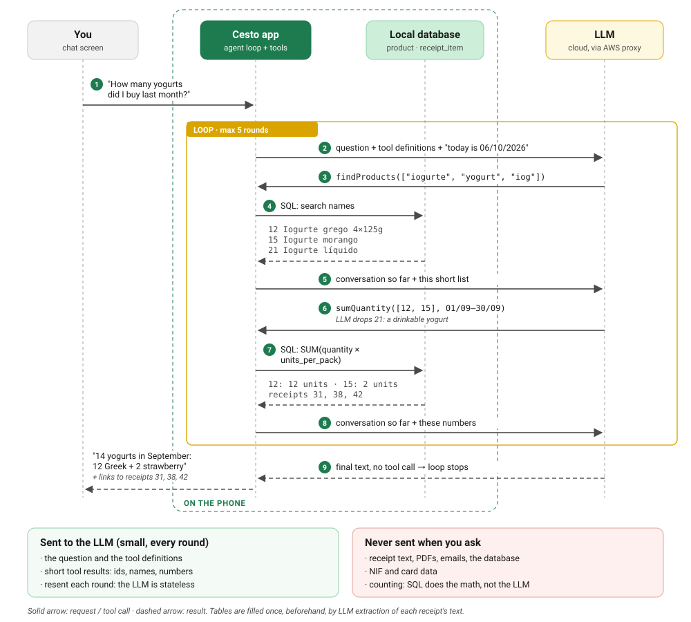
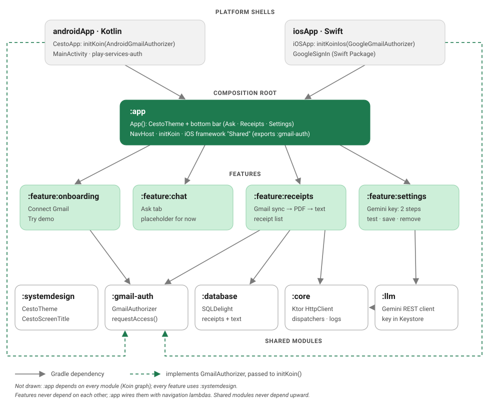
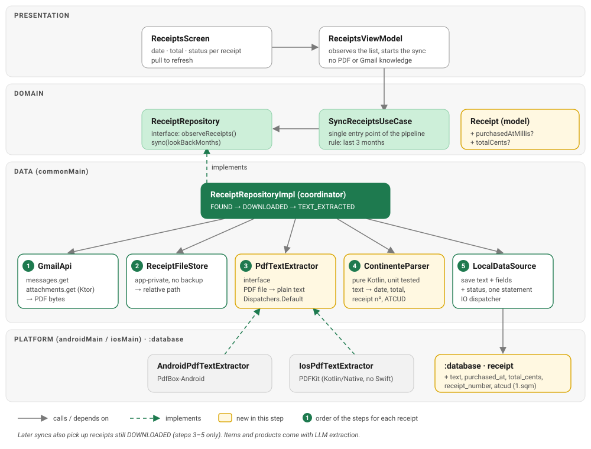

# Cesto

**Ask your grocery receipts anything.**

Cesto is a Kotlin Multiplatform app (Android + iOS) that finds your **Continente** grocery receipts in
Gmail and lets you ask questions about them in plain language:

> "How much did I spend in August?"
> "How much sugar did I buy last month?"
> "Did I buy anything with lactose?"

> **Status: early development.** Done so far: the modular KMP architecture, the light/dark theme,
> onboarding with the Gmail permission on Android and iOS, and the receipt sync: Cartão Continente
> receipt PDFs from Gmail into the local database and app-private files, their text read on the phone
> (date and total shown in the list). LLM extraction of the items and the chat are next (see [Roadmap](#roadmap)).

## How it will work

1. **Connect Gmail.** Google's own dialog asks for read-only access (`gmail.readonly`). ✅
2. **Find receipts.** Search Cartão Continente emails (`noreply@cartaocontinente.pt`) from the last
   3 months, up to 4 emails in parallel, and download the receipt PDFs. ✅
3. **Extract once.** PDF → text on the phone (date, total, receipt number, ATCUD) ✅ → an LLM turns the text
   into structured items, stored in the local database.
4. **Ask.** The LLM answers by calling a few *tools* (for example `sumSpending`, `sumNutrient`); the app
   runs them as SQL on the phone and only sends the small results back. Numbers come from SQL, not from
   the LLM's arithmetic.

### The agent loop (planned)



It's a loop, not one call: the LLM picks a tool, the app runs it on the phone and sends back only the small
result, and the LLM decides the next step, until it answers with text instead of a tool call (at most 5
rounds). The receipt text is used once, to fill the `product` and `receipt_item` tables; questions only
work on those tables.

### Privacy first

- Receipts, PDFs and the database stay **on the phone**. There is no app account and no backend login.
- The Gmail token never leaves the device; the app never sends, deletes or changes emails.
- The LLM never sees the database or raw emails, only small tool results. Its API key lives on a backend
  proxy, never in the app.

## Architecture



Feature modules with Clean Architecture inside each feature. One composition root (`:app`) knows every
module; everything else only knows what it needs.

| Module | Contains |
|---|---|
| [`androidApp`](androidApp) | Android entry point: `CestoApp` starts Koin, `MainActivity`, and `AndroidGmailAuthorizer` (Google Identity `AuthorizationClient`) |
| [`iosApp`](iosApp) | iOS entry point (SwiftUI) and `GoogleGmailAuthorizer` (GoogleSignIn, Swift Package) |
| [`:app`](app/src) | Composition root: `App()` with `CestoTheme`, the bottom bar (**Ask · Receipts · Settings**) and the `NavHost`, `initKoin()` with all Koin modules; builds the iOS framework `Shared` |
| [`:feature:onboarding`](feature/onboarding/src) | First screen: what Cesto reads and never does, **Connect Gmail**, **Try demo** |
| [`:feature:receipts`](feature/receipts/src) | Receipt sync (Gmail REST with Ktor → database → PDF files) and the receipt list with pull to refresh |
| [`:feature:chat`](feature/chat/src) | **Ask** tab: questions about your receipts, answered by Gemini with tools (placeholder for now) |
| [`:feature:settings`](feature/settings/src) | **Settings** tab: your own Gemini key in two steps, later Gmail and privacy (placeholder for now) |
| [`:gmail-auth`](gmail-auth/src) | `GmailAuthorizer`: the Gmail permission interface the platform apps implement |
| [`:systemdesign`](systemdesign/src) | `CestoTheme`: light and dark colour schemes; components used by 2+ features (`CestoScreenTitle`) |
| [`:core`](core/src) | Non-UI shared code: the Ktor `HttpClient` (OkHttp / Darwin engine) and its Koin module |
| [`:database`](database/src) | Local SQLite database (SQLDelight): receipts found in Gmail and the Gmail messages already checked; receipts fills it, chat will query it |

### Rules

- **Features never depend on each other.** `:app` connects them with navigation lambdas
  (`onConnected`, `onTryDemo`); each feature owns its route.
- **Floating pill bottom bar in `:app`** (`TopLevelDestination`): tabs draw behind it and get a `contentPadding`
  so their last item ends above it. The selected tab is derived from the back stack, each
  tab keeps its state when you switch, and back goes to **Ask**, then closes the app. Onboarding and demo
  mode are outside the bar.
- **Shared modules never depend upward**, and `:systemdesign` and `:core` don't know each other.
- **Inside a feature:** `presentation → domain ← data`. The domain is plain Kotlin; the data layer
  implements the domain's repository interfaces; ViewModels only call use cases.
- **Screen state lives in the ViewModel** (`StateFlow`), composables are stateless (`Route` + `Screen`).
- **Platform SDKs stay at the edge.** Where the iOS SDK is only practical from Swift (GoogleSignIn), the
  shared code defines an interface and the platform apps implement it and pass it to `initKoin()`.

### Gmail permission

Gmail access is an **OAuth scope**, not an OS permission: Google's SDK shows the consent dialog and
returns an access token, which Ktor sends with each Gmail REST call.

```
Connect Gmail ─► GmailAuthorizer (androidApp: AuthorizationClient · iosApp: GoogleSignIn)
                     └─► Google's account picker + consent ─► access token (stays on the phone)
App start     ─► same call without UI: already granted? ─► skip onboarding
Gmail request ─► same call without UI ─► "Authorization: Bearer <token>" (never asks the user)
```

### Receipt pipeline: PDF → text



The sync stays the single entry point (`SyncReceiptsUseCase`). `ReceiptRepositoryImpl` coordinates five
steps per receipt: download the PDF from Gmail, save the file, extract its text on the phone (PdfBox-Android
/ PDFKit), parse the fixed fields of a Continente receipt (date, total, receipt number, ATCUD), and save
them. Yellow boxes were added with this step; items and products come later with LLM extraction.
Receipts downloaded by an earlier app version are read from their saved file, without asking Gmail again.

## Tech stack

| Area | Library |
|---|---|
| UI | Compose Multiplatform 1.12 (Material 3), Navigation Compose 2.9 |
| DI | Koin 4.2 (`koin-compose-viewmodel`) |
| Network | Ktor 3.6 (OkHttp on Android, Darwin on iOS), kotlinx.serialization |
| Gmail permission | Google Identity `AuthorizationClient` (play-services-auth 22) · GoogleSignIn-iOS 10 |
| Database | SQLDelight 2.4 (Android driver, iOS native driver with the system SQLite), migrations in `.sqm` files |
| PDF text | PdfBox-Android 2.0.27 · PDFKit (iOS, called from Kotlin/Native) |
| Dates | kotlinx-datetime 0.8 |
| Tests | kotlin.test, kotlinx-coroutines-test, Ktor `MockEngine`, in-memory SQLite; shared tests run on Android and iOS |
| Planned | AWS LLM proxy, Open Food Facts |

Kotlin 2.4 · Android minSdk 24, targetSdk 37 · iOS 18.2+

## Getting started

### Requirements

- Android Studio with the Kotlin Multiplatform plugin; JDK 21 (Gradle downloads it if missing)
- Xcode 16+ for iOS

### Google Cloud setup (Gmail permission)

The app needs OAuth clients in a Google Cloud project:

1. Enable the **Gmail API**.
2. **Google Auth Platform:** consent screen *External*, publishing status **Testing**, add your Google
   account as a **test user**, and add the scope `.../auth/gmail.readonly`. `gmail.readonly` is a
   restricted scope: Testing mode (up to 100 test users) avoids Google's verification.
3. **Clients:**
   - **Android:** package `com.majidbahmani.cesto` + your debug keystore's SHA-1
     (`./gradlew :androidApp:signingReport`). Nothing to copy into the project.
   - **iOS:** bundle ID `com.majidbahmani.cesto.Cesto`. Copy
     `iosApp/Configuration/Secrets.xcconfig.example` to `Secrets.xcconfig` (gitignored) and fill in the
     client ID and its reversed form.

Without these the app still builds and runs; "Connect Gmail" then shows an error and **Try demo** works.

### Run

- **Android:** run `androidApp` from Android Studio, or `./gradlew :androidApp:installDebug`
- **iOS:** open [`iosApp/iosApp.xcodeproj`](iosApp) in Xcode and run (Xcode builds the Kotlin framework
  with `:app:embedAndSignAppleFrameworkForXcode`)

### Test

```bash
./gradlew testAndroidHostTest
./gradlew iosSimulatorArm64Test
```

The same `commonTest` tests run on the JVM and on the iOS simulator: the Gmail access wrapper, the
onboarding repository and ViewModel, the Gmail REST client (`MockEngine`) and message parsing, the
database schema and queries (in-memory SQLite), the HTTP client, and the Koin graph (`AppModulesTest`,
because Koin only reports missing bindings at runtime).

## Design decisions

| Decision | Why |
|---|---|
| Data on the device, not in the cloud | Receipts contain the NIF and shopping habits; Gmail is the source of truth, so nothing needs a backup; keeping restricted-scope Gmail data off servers avoids Google's security assessment |
| No Cognito / app accounts | The Gmail token would end up on AWS, and Cognito can't refresh Google tokens. One Google dialog is all the user sees |
| Extract once, then query with tools | Sending all receipt text per question is expensive and LLMs make arithmetic mistakes; SQL computes exact sums and scales to 10,000+ items |
| `:gmail-auth` as its own leaf module | Onboarding and receipts both need it, and features don't depend on each other |
| Platform implementations in the apps | GoogleSignIn is a Swift Package only practical from Swift; `AuthorizationClient` needs an Activity for the consent screen |
| Feature modules from the start | Onboarding, receipts and chat are separate features; the compiler enforces the dependency rules |
| Koin + Ktor | KMP-ready DI and HTTP; the engine is injected so tests use `MockEngine` |
| `:database` as a shared module | Receipts fill the database and the chat's SQL tools will query it; features can't depend on each other |
| Receipts keyed by Gmail `messageId + partId` | Gmail returns a different `attachmentId` on every request, so it can't identify a PDF; it's fetched fresh for each download |
| Sync: parallel, each email on its own | Up to 4 emails at once (a slow PDF doesn't block the others); each email is read once and its PDFs downloaded right away. An email is marked checked in the same transaction as its receipts; anything that failed is retried by the next sync, and only a failed search fails the whole sync |
| PDF → text on the phone, fixed fields without an LLM | The PDFs have a text layer; date, total, receipt number and ATCUD are on fixed lines, so they're read exactly and for free. Only the items (their order differs between PdfBox and PDFKit) need the LLM |
| Money in cents, receipt times in Lisbon time | Exact sums without floating point; the receipt's printed time is Portuguese local time wherever the phone is |
| Look-back period in the domain | "3 months" is a product rule (`SyncReceiptsUseCase`); the data layer turns it into Gmail syntax (`newer_than:3m`) |
| The list reads only the database | The sync writes, the screen observes (single source of truth); saved receipts stay visible offline or when Gmail fails |
| Relative PDF paths | iOS changes the app container's absolute path between installs and updates; PDFs are also excluded from iCloud backup |
| No Android backup (`allowBackup=false`, data extraction rules) | Receipt data never leaves the phone, not even to Google's backup or a new device; a new install syncs from Gmail again |

## Roadmap

- **v1: end to end.** ~~Gmail search + PDF download + receipt list~~ ✅ · ~~PDF → text (date, total)~~ ✅ · PDF viewer ·
  LLM extraction of the items ·
  Open Food Facts (sugar, ingredients, category) · chat with tool calling and an agent loop · AWS LLM
  proxy (API Gateway + Lambda + Secrets Manager) · demo mode with sample receipts
- **v2: RAG.** Embeddings + `semanticSearch` tool ("lactose" finds *IOG GREGO NAT*), nutrition guidelines
- **v3: on device.** ONNX embedding model, evaluation set, optional offline LLM, more stores

Receipts show what you **bought**, not what you ate: the app talks about "sugar in groceries purchased".
